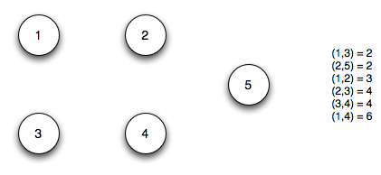
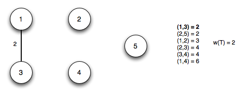
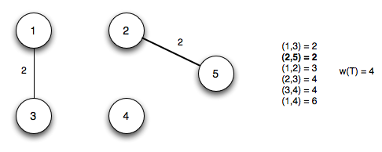
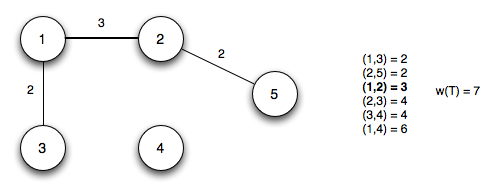
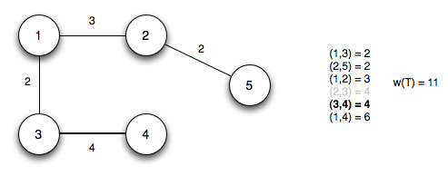
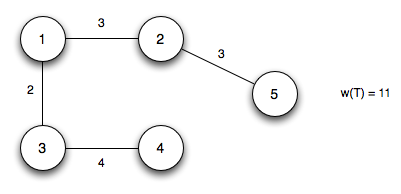

Another graph problem is given a set of vertices and (weighted) edges, find a subset of edges that connects all the vertices and has minimum total weight giving a *minimum spanning tree* (MST). An example of such a problem is determining the minimum amount of copper needed to produce a common ground in an electronic circuit. There are two well known algorithms for solving MST problems - Kruskal's algorithm and Prim's algorithm.

Minimum Spanning Trees
======================

**Problem**

Given a connected, undirected graph *G(V,E)* with *weighted edges* *w(u,v)*, find an *acyclic* subset of edges *T* ⊆ *E* that *connect* (or *span*) all the vertices and has minumum total weight, i.e.

> 

We call *T* a *minimum spanning tree* of *G*. While the value *w(T)* is unique, the tree itself may not be.

**Generic Algorithm**

If *A* is a subset of an MST, then a *safe edge* is one such that

> *A*' = *A* ∪ (*u*,*v*)

is also a subset of an MST.

We can then find an MST by beginning with any vertex and adding safe edges until *A*' forms a spanning tree. This tree will contain |*V*| - 1 edges and be a mininum spanning tree. Hence we simply need a way to determine safe edges.

A *cut* is a partition of *V* into two subsets {*S*} and {*V-S*}. An edge *crosses* the cut if one vertex is in {*S*} and the other is in {*V-S*}. A set of edges *A*, *respects* a cut if none of the edges in *A* crosses the cut. A *light edge* is an edge that crosses a cut with minimum weight.

Using these definitions, we can prove the following theorem:

> Given a connected, undirected graph *G(V,E)* with edge weights *w(u,v)*
>
> If *A* is a subset of an MST, for any cut that respects *A* ⇒ a light edge is a safe edge for *A*. (Note the *converse* is *not* true.)

An immediate corrolary is that if we have a forest of connected components (trees) each with a set of minimum spanning edges, then any light edge between the trees is a safe edge. Hence we can grow the MST by simply adding |*V*| - 1 light edges between subsets of the MST.

Kruskal's Algorithm
===================

A simple way to implement the generic algorithm is to grow the MST by adding edges between trees in the forest in order of increasing weights until all trees are connected. This approach is known as *Kruskal's algorithm*.

**Algorithm**

	MST-KRUSKAL(G,w)
	1.  A = ∅
	2.  for each vertex v ∈ G.V
	3.     MAKE-SET(v)
	4.  sort the edges of G.E into nondecreasing order by weight w
	5.  for each edge (u,v) ∈ G.E, taken in nondecreasing order by weight
	6.     if FIND-SET(u) ≠ FIND-SET(v)
	7.        A = A ∪ {(u,v)}
	8.        UNION(u,v)
	9.  return A

Basically the algorithm works as follows:

> 1.  Make each vertex a separate tree
> 2.  Sort the edges in nondecreasing order
> 3.  Add an edge if it connects different trees and merge the trees together

The run time of Kruskal's algorithm depends on the implementation of the set operations, but can be made to run in O(*E* lg *V*).

**Example**

Given the following undirected graph

> 

We first make each vertex a separate tree and sort the edges in nondecreasing order

> 

*Step 1*: Add edge (*u*1,*u*3) and merge *u*1 and *u*3

> 

*Step 2*: Add edge (*u*2,*u*5) and merge *u*2 and *u*5

> 

*Step 3*: Add edge (*u*1,*u*2) and merge the tree from step 1 with the tree from step 2

> 

*Step 4*: Add edge (*u*3,*u*4) (note edge (*u*2,*u*3) does not connect separate trees) and merge *u*4

> 

The final edge (*u*1,*u*4) does not connect separate trees. Thus the final MST is

> 

with total weight 11.

